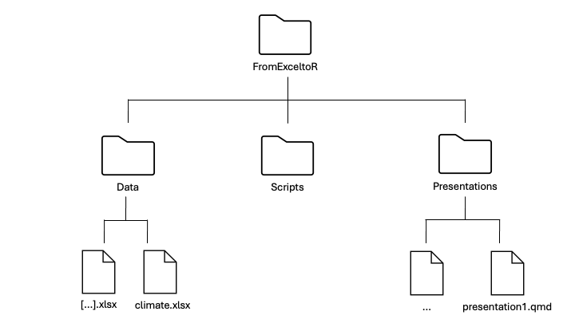

```{r setup, include=FALSE}
knitr::opts_chunk$set(echo = TRUE, eval = FALSE)
```

Before diving into the hands-on exercises, it’s important to get your files organized so everything runs smoothly. In coding, we refer to folders as *directories*, and we often describe their structure using a *file tree* — a visual or written outline that shows how files and folders are arranged. Setting up a clear file tree will save you time and frustration later. This short setup will make sure all your data, presentations, and scripts are easy to find and ready to use. Follow the steps below carefully — they’ll help you stay organized throughout the course.

## File Tree

1.  Make a new directory for this course called *FromExceltoR.*

2.  Go to course website and to the *Data* tab. Press the **DOWNLOAD DATA** button.

3.  Move the *Data* folder to your *FromExceltoR* directory and unzip it.

4.  Download the presentations via the **DOWNLOAD PRESENTATIONS** button and move it to your *FromExceltoR* directory and unzip it, just like you did with the Data folder.

5.  Under your *FromExceltoR* directory, make a new directory for your scripts called *Scripts*.

Make sure your file tree looks like this:

{fig-align="center"}
