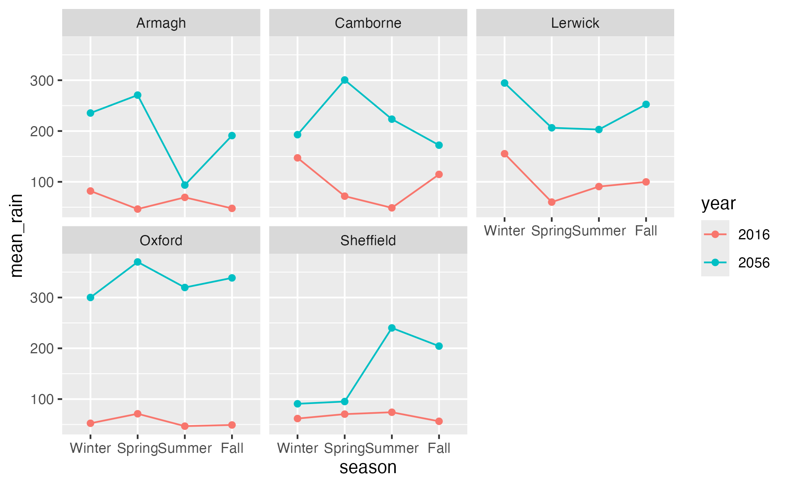
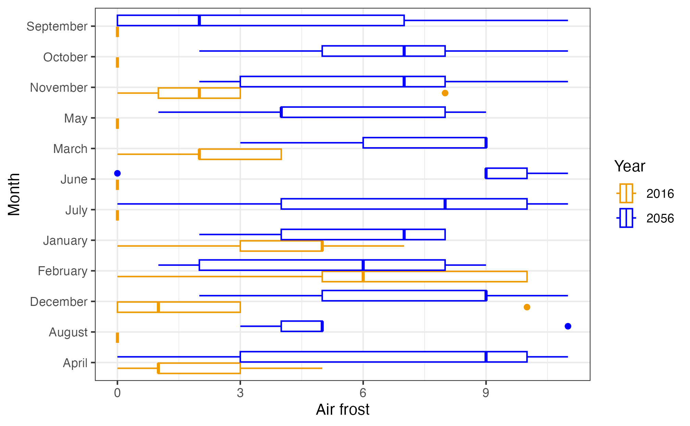
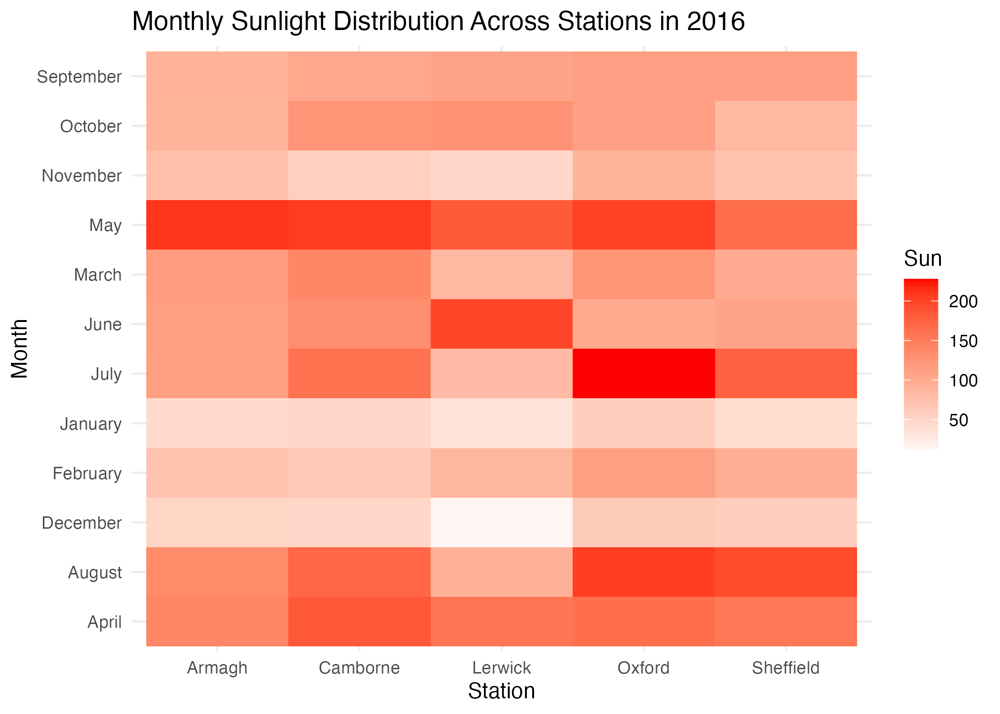

```{r setup, include=FALSE}
knitr::opts_chunk$set(echo = TRUE, eval = FALSE)
```

## Getting started

Before you proceed with the exercises in this document, make sure to run the command `library(tidyverse)` in order to load the core **tidyverse** packages (including **ggplot2**).

The data set used in these exercises, **climate.xlsx**[^1], was compiled from data downloaded in 2017 from the website of the UK's national weather service, the [*Met Office*](http://www.metoffice.gov.uk/public/weather/climate-historic/).

[^1]: Contains public sector information licensed under the [Open Government Licence v3.0](http://www.nationalarchives.gov.uk/doc/open-government-licence/version/3/).

The spreadsheet contains data from five UK weather stations in 2016. The following variables are included in the data set:

| Variable name | Explanation                         |
|---------------|-------------------------------------|
| **station**   | Location of weather station         |
| **year**      | Year                                |
| **month**     | Month                               |
| **af**        | Days of air frost                   |
| **rain**      | Rainfall in mm                      |
| **sun**       | Sunshine duration in hours          |
| **device**    | Brand of sunshine recorder / sensor |

The data set is the same as the one used for the Tidyverse exercise. If you have already imported the data, there is no need to import it again, unless you have made changes to the data assigned to `climate` since the original data set was imported.

**Need a little help?** Consult the ggplot2 cheatsheet here: <https://rstudio.github.io/cheatsheets/data-visualization.pdf>

## Scatter plot I

1.  Make a scatter (point) plot of **rain** against **sun**.

2.  Color the points in the scatter plot according to weather station. Save the plot in an object.

3.  Add the segment `+ facet_wrap(vars(station))` to the saved plot object from above, and update the plot. What happens?

4.  Is it necessary to have a legend in the faceted plot? How can you remove this legend?

::: {.callout-tip collapse="true"}
## Hint

try adding a `theme()` with `legend.position = "none"` inside it.
:::

## Graphic files

5.  Use `ggsave(file="weather.jpeg")` to re-make the last ggplot as a jpeg-file and save it. The file will be saved on your working directory. Locate this file on your computer and open it.

6.  Use `ggsave(file="weather.png", width=10, height=8, units="cm")` to re-make the last ggplot as a png-file and save it. What do the three other options do? Look at the help page `?ggsave` to get an overview of the possible options.

## Scatter plot II: error bars

7.  Calculate the average and standard deviation for sunshine in each month and save it to a table called `summary_stats`. You will need `group_by` and `summarize`. Recall how to do this from the tidyverse exercise.

8.  Make a scatter plot of the summary_stats with month on the x-axis, and the average number of sunshine hours on the y-axis.

9.  Add error bars to the plot, which represent the average number of sunshine hours plus/minus the standard deviation of the observations. The relevant geom is called `geom_errorbar`.

::: {.callout-tip collapse="true"}
## Hint

```{r eval=FALSE}
geom_errorbar(aes(ymin = sun_avg - sun_sd, 
                  ymax = sun_avg + sun_sd), width = 0.2)
```
:::

## Line plot (also known as a spaghetti plot)

10. Make a line plot (find the correct `geom_` for this) of the rainfall observations over time (month), such that observations from the same station are connected in one line. Put month on the x-axis. Color the lines according to weather station as well.

11. The **month** variable was read into R as a numerical variable. Convert this variable to a factor and make the line plot from 11 again. What has changed?

::: {.callout-tip collapse="true"}
## Hint

If variable is a factor the `geom_line` function needs the `group` aesthetic to stratify categories.

```{r eval=FALSE}
aes(group = station)
```
:::

12. Use `theme(legend.position = ???)` to move the color legend to the top of the plot.

## Layering

We can add several geoms to the same plot to show several things at once.

13. Add `geom_point()` to the line plot from above.

14. Now, add `geom_hline(yintercept = mean(climate$rain), linetype = "dashed")` at the end of your code for the line plot, and update the plot again. Have a look at the code again and understand what it does and how. What do you think 'h' in hline stands for?

15. Finally, try adding the following code and update the plot. What changed? Replace `X`, `Y`, `COL`, and `TITLE` with some more suitable (informative) text.

```{r, eval = FALSE}
labs(x = "X", y = "Y", color = "COL", title = "TITLE")
```

## Box plot I

16. Make a box plot of sunshine per weather station.

17. Color the boxes according to weather station.

## Box plot II - Aesthetics

There are many ways in which you can manipulate the look of your plot. For this we will use the boxplot you made in the exercise above.

18. Change the theme of the ggplot grid. Suggestions: `theme_minimal()`, `theme_bw()`, `theme_dark()`, `theme_void()`.

19. Instead of automatically chosen colors, pick your own colors for `fill = station` by adding the `scale_fill_manual()` command. You will need five colors, one for each station. What happens if you choose too few colors?

20. Change the boxplot to a **violin plot**. Add the sunshine observations as scatter points to the plot. Include a boxplot inside the violin plot with `geom_boxplot(width=.1)`.

## Histogram

21. Make a histogram of rain from the climate dataset (find the correct `geom_` for this). Interpret the plot, what does it show?

22. Color the entire histogram. Here we are not coloring/filling according to any attribute, just the entire thing so the argument needs to be **outside** `aes()`.

## Bar chart I

23. Make a bar chart (`geom_col()`) which visualizes the sunshine hours per month. If you have not done so in question 12, convert month to a factor now and remake the plot.

24. Color, i.e. divide the bars according to weather station.

25. For better comparison, place the bars for each station next to each other instead of stacking them.

26. Make the axis labels, legend title, and title of the plot more informative by customizing them like you did for the line plot above.

## Bar chart II: Sorting bars

27. Make a new bar chart showing the (total) annual rainfall recorded at each weather station. You will need to calculate this first. The format we need is a dataframe with summed up rain data per station.

28. Sort the stations in accordance to rainfall, either ascending or descending. This was shown in the ggplot lecture. Sort your rain dataframe from the question above by sum, then re-arrange the factor-levels of the 'station' as shown in the lecture.

29. Add labels to each bar that state the sum of the rainfall per station. You can do this by adding `geom_label()` to the plot and providing the information under the `label` keyword inside the `aes()`.

30. Adjust the label positions so that the labels are positioned above the bars instead of inside them.

::: {.callout-tip collapse="true"}
## Hint

Look up `geom_label` function and pay attention to the `position` variable.
:::

## Wrapping up

31. Like in the last exercise; imagine you need to send your code to a collaborator. Review your code to ensure it is clear and well-structured, so your collaborator can easily understand and follow your work. Render your Quarto document and look at the result. Try to change the size of a figure by modifying the chunk header.

## Optional section

32. Load in the climate change dataset you exported in the last optional exercises.

33. Use `group_by`, `summarize`, and `facet_wrap` to recreate this plot. Consider if you need to change the class of some of the variables prior to plotting. 

34. Your supervisor does not like colors. Change the stratification to be based on `linetype` instead of `color`. Add a white background, update the labels to start with uppercase letters, and provide the plot with a meaningful title.

35. Recreate this plot. Use whatever colors you like (but change them from the default coloring) and give the plot at meaningful title. 

36. Recreate this plot using `geom_tile()` to make a heatmap, and `scale_fill_gradient2()` to select custom colors. 

37. Make the same plot as above for year 2056. Compare the two plots. How will the sunlight change across stations and months?
