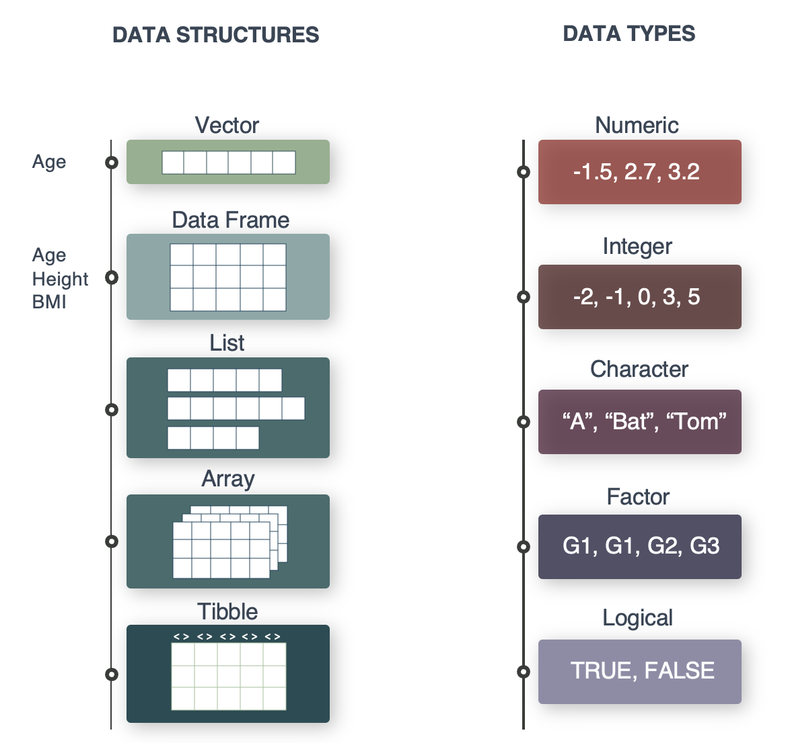

Want to code along? Go to the Data tab of the website and press the **DOWNLOAD PRESENTATIONS** button. This is presentation 1.

# The Quarto Way!

[Quarto](https://quarto.org/) is an open-source publishing suite - a tool-suite that supports workflows for reproducible scholarly writing and publishing.

Quarto documents often begin with a `YAML header` demarcated by three dashes (`---`) which specifies things about the document. This includes what type of documents to render (compile) to e.g. HTML, PDF, WORD and whether it should be published to a website project. You can also add information on project title, author, default editor, etc.

# Quarto uses a markup language

Quarto works with `markup language`. A [markup language](https://en.wikipedia.org/wiki/Markup_language) is a text-coding system which specifies the structure and formatting of a document and the relationships among its parts. Markup languages control how the content of a document is displayed.\
`Pandoc Markdown` is the markup language utilized by Quarto - another classic example of a markup language is `LaTeX`.

Let´s see how the pandoc `Pandoc Markdown` works:\

### This is the third largest header (Header 3)

###### This is the smallest header (Header 6)

Headers are marked with hashtags. More hashtags equals smaller title.

This is normal text. Yes, it is larger than the smallest header. A Quarto document works similarly to a Word document where you can select tools from the toolbar to write in **bold** or *italic* and insert thing like a table:

| My friends | Their favorite drink | Their favorite food |
|------------|----------------------|---------------------|
| Michael    | Beer                 | Burger              |
| Jane       | Wine                 | Lasagne             |
| Robert     | Water                | Salad               |

... a picture:

{fig-alt="Miw" fig-align="center" width="500"}

[Picture source](https://www.zooplus.co.uk/magazine/cat/kitten/how-to-monitor-your-kittens-weight)

We can also make a list of things we like:

-   Coffee

-   Cake

-   Water

-   Fruit

## Modes of Quarto Document

There are two modes of Quarto: **Source and Visual**. In the left part of the panel you can change between the two modes.\

Some features can only be added when you are in Source mode. E.g [write blue text]{style="color:blue"} is coded like this in the source code `[write blue text]{style="color:blue"}`.

[*Note: Sometimes, if you are stuck in Quarto’s Visual mode, it’s worth switching between Source and Visual modes to reset things.\
*]{style="color:red"}

## Code chunks and structure

Code chunks are where the code is added to the document.

Click the green button `+c` and a grey code chunk will appear with `'{r}'` in the beginning. This means that it is an R code chunk. It is also possible to insert code chunks of other coding language.

\
For executing the code, press the `Run` button in the top right of the chunk to evaluate the code.

```{r}

```

some executable code in an R code chunk.

```{r}
1+3
```

Below is a code chunk with a comment. A comment is a line that starts with a hashtag. Comments can be useful in longer code chunks and will often describe the code.

```{r}
# This is a comment. Here I can write whatever I want because it is in hashtags. 
```

You can add comments above or to the right of the code. This will not influence the executing of the code.

```{r}
# Place a comment here 
1+3 # or place a comment here
```

## Output of code chunks

**Control whether code is executed.**

**eval=FALSE** will not execute the code and **eval=TRUE** will execute the code in the compiled document.

The code is shown, but the result is not shown (`{r, echo=TRUE, eval=FALSE}`):

```{r echo=TRUE, eval=FALSE}
1+3
```

**Show or hide code.** `echo=FALSE` will hide the code and `echo=TRUE` will show the code. Default is TRUE.

The code is not shown, but the result is shown (`{r, echo=FALSE, eval=TRUE}`):

```{r echo=FALSE}
# The code will be hidden in the compiled document, but the output will be shown.
1+3
```

**Control messages, warnings and errors.** Maybe you have a code chunk that you know will produce one of the three and you often don't want to see it in the compiled document.

```{r}
log(-1)
```

Warning and error is [not]{.underline} printed (`{r, message=FALSE, warning=FALSE, error=TRUE}`):

```{r warning=FALSE}
log(-1)
```

```{r error = TRUE}
stop("Intentional error for teaching.")
```

If an error occurs unexpectedly during rendering, Quarto will halt the render, so errors should be fixed (or intentionally demonstrated using `error: true` / `tryCatch()`).

N.B! It is not a good idea to hide these statements (especially the errors) before you know what they are.

## Render: Making the report

In the panel there is a blue arrow and the word *Render*. Open the rendered html file in your browser and admire your work.

# Data type and structures

{fig-align="center"}

**Now let's get back to coding!**\

In the example below we will make two vectors into a tibble. Tibbles are the R object types you will mainly be working with in this course. We will try to convert between data types and structures using the collection of 'as.' functions.

**A vector of characters**

```{r}
people <- c("Anders", "Diana", "Tugce", "Henrike", "Chelsea", "Valentina", "Thilde", "Helene")
people
```

**A vector of numeric values**

```{r}
joined_year <- c(2019, 2020, 2020, 2021, 2023, 2022, 2020, 2024)
joined_year
```

**Access data type or structure with the class() function**

```{r}
class(people)
class(joined_year)
```

**Convert joined_year to character values**

```{r}
joined_year <- as.character(joined_year)
joined_year
class(joined_year)
```

**Convert joined_year back to numeric values**

```{r}
joined_year <- as.numeric(joined_year)
joined_year
```

**Convert classes with the 'as.' functions**

```{r}

# We will try to convert between data types and structures using the collection of 'as.' functions.

# as.numeric()
# as.integer()
# as.character()
# as.factor()
# ...

```

**Let's make a tibble from two vectors**

```{r}
library(tidyverse) # run each time you start R

my_data <- tibble(name = people, 
                  joined_year = joined_year)

my_data
class(my_data)
```

Just like you can convert between different data types, you can convert between data structures/objects.

**Convert tibble to dataframe**

```{r}
my_data2 <- as.data.frame(my_data)
class(my_data2)
```

**Convert classes with the 'as.' functions**

```{r}
# as.data.frame()
# as.matrix()
# as.list()
# as.table()
# ...
# as_tibble()
```

# Fundamental operations

You can inspect an R objects in different ways:

1\. Simply call it and it will be printed to the console.

2\. With large object it is preferable to use \`head()\` or \`tail()\` to only see the first or last part.

3\. To see the data in a tabular excel style format you can use \`view()\`

**Look at the "head" of an object:**

```{r}
head(my_data, n = 4)
```

**Open up tibble as a table (Excel style):**

```{r}
view(my_data)
```

**dim(), short for dimensions, which returns the number of rows and columns of an R object:**

```{r}
dim(my_data)
```

**Look at a single column from a tibble using the '\$' symbol:**

```{r}
my_data$joined_year
```
