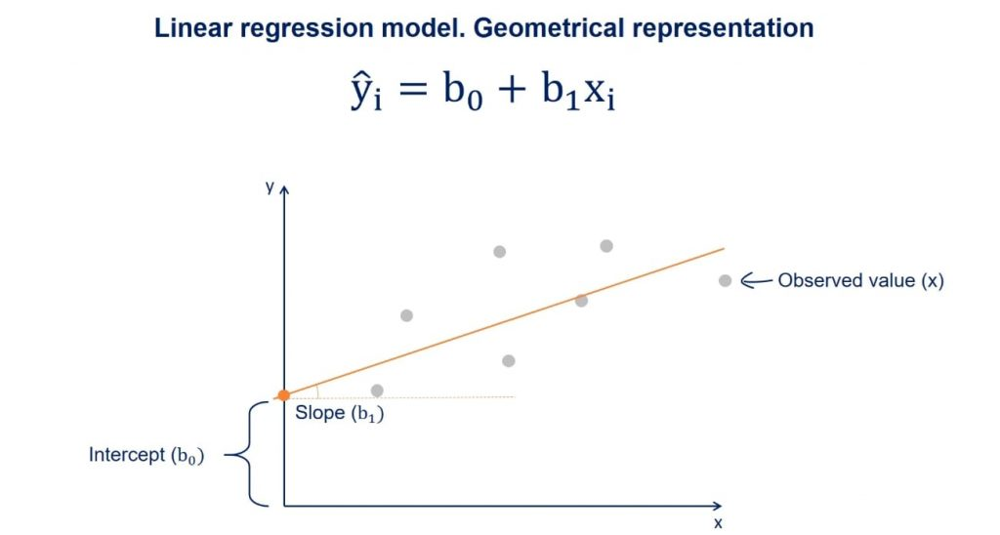

```{r setup, include=FALSE}
knitr::opts_chunk$set(echo = TRUE)
```

## Introduction

In this exercise you will practice your newly acquired R skills on an example dataset.

If you have your own data to work on, you can still follow the steps in the exercise where they apply.

```{r, echo=FALSE, warning=FALSE, message=FALSE}
library(tidyverse)
library(MASS)
```

------------------------------------------------------------------------

## R-packages

For the data wrangling and statistical modelling we will be doing in this exercise, you will need the following R-packages: `tidyverse`, `ggplot2`, `emmeans`, `MASS`.

-   Make sure that these packages are installed and loaded into your R environment. You likely have the packages already installed and loaded (you used these in the previous exercises) try `sessionInfo()` and `require()` (look up what these function do). If the packages are not there install them and library them as in the previous exercises.

------------------------------------------------------------------------

## Getting the Dataset

For this exercise, we'll use the birthweight dataset from the package `MASS`. It contains the birthweight of infants and some information about the mother.

To get it we have to load the package and then the data. We will also display the help so we can read some background info about the data and what the columns are:

```{r message=FALSE, warning=FALSE}
data(birthwt)
?birthwt #display help page
```

**N.B** If it says `<Promise>` after `birthwt` in your global environment just click on it and the dataframe will be loaded properly.

*If you have a dataset of your own you would like yo look at instead of the example data we provide here, you are very welcome to. You can again use `read_excel()` for excel sheets. For other formats, have a look at `read.csv()`, `read.table()`, `read.delim()`, etc. You can either google your way to an answer or ask one of the course instructors.*

-   Now, check the class of the dataset. We'll be using `tidyverse` to do our anaylsis, so if it isn't already a tibble, make it into one.

Check class of data. 
```{r}
class(birthwt)
```

Convert into tibble.
```{r}
birthwt <- as.tibble(birthwt)
```

Check class of data to confirm that it is a tibble. 
```{r}
class(birthwt)
```


------------------------------------------------------------------------

## Exploratory Analysis

### The Basics

Before performing any statistical analysis (modelling), it is necessary to have a good understanding of the data. Start by looking at:

-   How many variables and observations are there in the data?
```{r}
birthwt %>% count()
```

-   What was measured, i.e. what do each of the variables describe? You can rename variables via the `colnames()` if you want to.

Run the command below to inspect the data. This can only be done to this dataset because it was loaded from a packages. Hence you will not be able to do this with your own data. 
```{r}
?birthwt
```


-   Which data types are the variables and does that make sense? Should you change the type of any variables? *Hint:* Think about types `factor, numerical, integer, character, etc.`

```{r}
str(birthwt)
```
Change the appropriate variables to factor.
```{r}
birthwt <- birthwt %>% 
  mutate(low = factor(low),
         race = factor(race),
         smoke = factor(smoke), 
         ht = factor(ht), 
         ui = factor(ui)
         )
```


-   What is our response/outcome variable(s)? There can be several.
`bwt` (birth weight) and `low` (the indicator of birth weight less than 2.5 kg).


-   Is the (categorical) outcome variable balanced?
No, the categorical outsome variable (`low`) is nit very balanced. 
```{r}
birthwt$low %>% table()
```


-   Are there any missing values (`NA`), if yes and how many? Google how to check this if you don't know.
No, there are no `NA` values in any of the columns. 
```{r}
birthwt %>% is.na() %>% colSums()
```


------------------------------------------------------------------------

## Diving into the data

### Numeric variables

Some of the measured variables in our data are numeric, i.e. continuous. For these do:

-   Calculate summary statistics (mean, median, sd, min, max)
Calculate mean, median, minimum and maximum with `summary` function. 
```{r}
birthwt %>% 
  dplyr::select(age, lwt, ptl, ftv, bwt) %>% 
  summary()
```

Calculate standard deviation. 
```{r}
birthwt %>% 
  dplyr::select(age, lwt, ptl, ftv, bwt) %>% # Specify select function from the dplyr package. 
  summarize(age_sd = sd(age),
            lwt_sd = sd(lwt),
            ptl_sd = sd(ptl),
            ftv_sd = sd(ftv),
            bwt_sd = sd(bwt)
  )
```

-   Create boxplots for each numeric variable using `ggplot2`, and apply `scale_x_discrete()` to prevent meaningless scaling of the boxplot widths.
Do this for all the numeric variables (`age`, `lwt`, `ptl`, `ftv`, `bwt`).
```{r}
ggplot(birthwt,
       aes(y = age)) + 
  geom_boxplot() + 
  scale_x_discrete()
```

-   Do you see outliers in your dataset?
Look at the point in the data set. 

-   Now remake the boxplot with two different colors, depending on the (categorical) outcome variable.
```{r}
ggplot(birthwt,
       aes(y = age, 
           fill = low)) + 
  geom_boxplot() + 
  scale_x_discrete() + 
  scale_fill_manual(values = c('black', 'grey')) + 
  theme_bw() 
```

### Categorical variables

Other columns describe variables that are categorical. Some of these may have been initially interpreted by R as numerical, especially if they are coded with 0/1.

-   If you haven't changed their datatype to factor yet, do so now. You can see how in Presentation 5.
We did this in the beginning. 

-   When you are done, make barplots of each categorical variable.
Do for each of the categorical variables (`race`, `smoke`, `ht`, `ui`)
```{r}
ggplot(birthwt, 
       aes(x = smoke)) + 
  geom_bar()
```


-   Then, split up the barplot for `smoke` so you have two different colors for the two different values of the outcome variable (the same way you did it above for the boxplots).
```{r}
ggplot(birthwt, 
       aes(x = smoke, 
           fill = low)) + 
  geom_bar(position = 'dodge') + 
  scale_fill_manual(values = c('black', 'grey')) + 
  theme_bw() 
```

-   Now, add the argument `position ='dodge'` to geom_bar and remake the plot. What has changed? Then remake it once again with `position ='fill'`. What information do the different barplots show? Compare to the counts you get from the `smoke` column when you group the dataframe by the outcome variable.
```{r}
ggplot(birthwt, 
       aes(x = smoke, 
           fill = low)) + 
  geom_bar(position = 'fill') + 
  scale_fill_manual(values = c('black', 'grey')) + 
  theme_bw() 
```

-   Lastly, make a density plot of the two continuous variables `lwt` and `bwt`, split it up by `smoke`.
Just showed for `lwt` here. 
```{r}
ggplot(birthwt,
       aes(x = lwt,
           color = smoke)) + 
  geom_density() + 
  scale_color_manual(values = c('black', 'grey')) + 
  theme_bw()
```


Extra: Pick custom colors for your plots (look into `scale_fill_manual()`).

### Subsetting the data

Based on what you have observed in the last two sections, now choose two numeric variables and two categorical variables to move forward with. Create a subset of the dataframe with only these variables and the categorical and numeric outcome.

```{r}
birthwt_subset <- birthwt %>% dplyr::select(age, lwt, smoke, ptl, low, bwt)

head(birthwt_subset)
```

------------------------------------------------------------------------

## Modelling

You now have a prepared dataset on which we can do some modelling.

### Regression Model 1

In the Applied statistics session you've tried out an analysis with one way ANOVA, where you compared the effect of categorical variables (skin type) on the outcome (gene counts).

We'll do something similar here but instead we will use the numerical variables as predictors and the measured birthweight as the (numerical) outcome. This is what is known as linear regression.



We can also do this with `lm()` and follow the same syntax as before:

```{r, eval=FALSE}
model1 <- lm(resp ~ pred1, data=name_of_dataset)
```

Simply, if the outcome variable we are interested in is continuous, then `lm()` will functionally be doing a linear regression. If the outcome is categorical, it will be performing ANOVA (which if you only have two groups is effectively a t-test). Have a look at [this video](https://www.youtube.com/watch?v=NF5_btOaCig&list=PLblh5JKOoLUIzaEkCLIUxQFjPIlapw8nU&index=5) if you want to understand why you can do a t-test / ANOVA with a linear model.

-   Now, pick one of your numeric variables and use it to model the (numeric/continuous) outcome.
```{r}
model1_lwt <- lm(bwt ~ lwt, data = birthwt_subset)
```


-   Investigate the model you have made by writing its name, i.e.

```{r, eval = FALSE}
model1_lwt
```

-   What does this mean? Compare to the linear model illustration above.
At the intercept the `lwt` (mother's weight in pounds) is 0 (very unrealistic) the `bwt` is 2369.624 grams. For each pound that a mother weighs more, the `btw` is 4.429 grams more. 

-   We'll now make a plot of your model to help us better visualize what has happened. Make a scatter plot with your predictor variable on the x-axis and the outcome variable on the y-axis.
```{r}
ggplot(birthwt_subset, 
       aes(x = lwt,
           y = bwt)) + 
  geom_point()
```


-   Now add the regression line to the plot by using the code below. For the slope and intercept, enter the values you found when you inspected the model. Does this look like a good fit?
```{r, eval = FALSE}
ggplot(birthwt_subset, 
       aes(x = lwt,
           y = bwt)) + 
  geom_point() + 
  geom_abline(slope = model1_lwt$coefficients["lwt"], 
              intercept = model1_lwt$coefficients["(Intercept)"], 
              color = 'red')
```

-   Repeat the process with the other numeric variable you picked.
```{r}
model1_age <- lm(bwt ~ age, data = birthwt_subset)
model1_age
```

```{r, eval = FALSE}
ggplot(birthwt_subset, 
       aes(x = age,
           y = bwt)) + 
  geom_point() + 
  geom_abline(slope = model1_age$coefficients["age"], 
              intercept = model1_age$coefficients["(Intercept)"], 
              color = 'red')
```

Sometimes the variables we have measured are not good at explaining the outcome and we have to accept that.

-   Instead of the `geom_abline()`, try `geom_smooth()` which provides you with a confidence interval in addition to the regression line. Look at the help for this geom (or google) to figure out what argument it needs to work!
```{r}
ggplot(birthwt_subset, 
       aes(x = age,
           y = bwt)) + 
  geom_point() + 
  geom_smooth(formula = y ~ x,
              color = 'red')
```


-   Inspect your model in more detail with `summary()`. Look at the output, what additional information do you get about the model. Pay attention to the `Residual standard error (RSE)` and `Adjusted R-squared (R2adj)` at the bottom of the output. We would like `RSE` to be as small as possible (goes towards 0 when model improves) while we would like the `R2adj` to be large (goes towards 1 when model improves).
```{r}
summary(model1_lwt)
```

```{r}
summary(model1_age)
```

**N.B** if you want to understand the output of a linear regression summary in greater detail have a look [here](https://feliperego.github.io/blog/2015/10/23/Interpreting-Model-Output-In-R).

```{r, eval = FALSE}
summary(model1)
```

### Regression Model 2

-   Remake your model (call it `model2`) but this time add an additional explanatory variable to the model in addition to `lwt`. This should be one of the categorical variable you selected to be in your subset. (`smoke` might be interesting, but you could also try either `age` and/or `ht`). Does adding this second exploratory variable improve the metrics `RSE` and/or `R2adj`?

```{r, eval = FALSE}
model2 <- lm(resp ~ pred1 + pred2, data=name_of_dataset)
```

```{r}
model2 <- lm(bwt ~ lwt + age, data=birthwt_subset)
model2
```

```{r}
summary(model2)
```


-   Find the 95% confidence intervals for model2, by using the `confint()` function. If you are not familiar with confidence intervals, have a look [here](https://sphweb.bumc.bu.edu/otlt/mph-modules/bs/bs704_confidence_intervals/bs704_confidence_intervals_print.html).
```{r}
confint(model2)
```


-   Try the following commands (or a variation of it, depending on which variables you have included in model2), and see if you can figure out what the outcome means.

```{r, eval = FALSE}
newData <- data.frame(lwt=100, age = 50, smoke=as.factor(1))
newData
predict(model2, newData)
predict(model2, newData, interval="prediction")
```

------------------------------------------------------------------------

### Bonus Exercise - ANOVA

Now, we will instead look at the two categorical variables you picked. Make a model of the outcome variable depending on one the categorical variable

-   Pick one of the two categorical variables and use it to model the (numeric) outcome, just as during the Applied Stats session:

```{r, eval=FALSE}
model3 <- lm(bwt ~ smoke, data=birthwt_subset)
```

-   inspect the output by calling `summary()` on the model

```{r, eval=FALSE}
summary(model3)
```

You can have a look at [this website](https://www.learnbymarketing.com/tutorials/explaining-the-lm-summary-in-r/) to help you understand the output of summary.

### Short detour: The meaning of the intercept in an ANOVA

The intercept is the estimate of the outcome variable that you would get when all explanatory variables are 0.

So if we have the model `lm(bwt ~ smoke, data = birthData)` and smoke is coded as 0 for non-smokers and 1 for smokers, the intercept is the estimate birthweight of a baby of a non-smoker. It will be significant because it is significantly different from 0, but that doesn't mean much since we would usually expect babies to weight more than 0.

You can now make some other models, including several predictors and see what you get.
