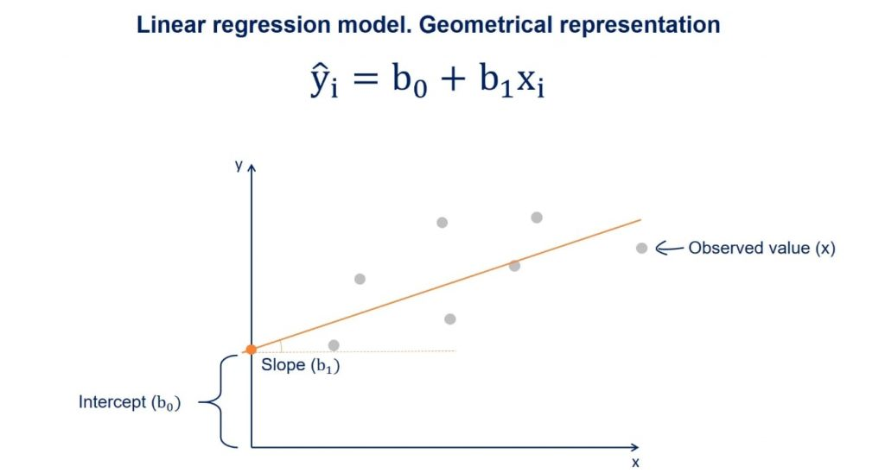

```{r setup, include=FALSE}
knitr::opts_chunk$set(echo = TRUE)
```

## Introduction:

In this exercise you will practice your newly acquired R skills on an example dataset.

If you have your own data to work on, you can still follow the steps in the exercise where they apply.


```{r, echo=FALSE, warning=FALSE, message=FALSE}
library(tidyverse)
```


---

## Getting the Dataset:

For this exercise, we'll use the birthweight dataset from the package `MASS`. It contains the birthweight of infants and some information about the mother. 

To get it we have to load the package and then the data. We will also display the help so we can read some background info about the data and what the columns are

```{r message=FALSE, warning=FALSE}
library(MASS)
data(birthwt)
?birthwt #display help page
```

If it says `<Promise>` after `birthwt` in your global environment just click on it and the dataframe will be loaded properly.   

Now, check the class of the dataset. We'll be using tidyverse to do our anaylsis, so if it isn't already a tibble, make it into one.

If you want to read in your own dataset you can again use `read_excel()` for excel sheets. For other formats, have a look at `read.csv()`, `read.table()`, `read.delim()`, etc. You can either google your way to an answer or ask one of the course instructors. 

---

## Exploratory Analysis

### The Basics

Before making any statistical models, it is necessary to have a good understanding of what the data is. Start by looking at:

- How many variables and observations are there in the data? 

- What was measured, i.e. what do each of the variables describe? You can rename variables via the `colnames` if you want to.

- Which data types are the variables and does that make sense? Should you change the type of any variables?

- What is our response/outcome variable(s)? There can be several.

- Is the (categorical) outcome variable balanced?

- Are there any missing values (`NA`), if yes and how many?   

## Diving into the data

### Numeric variables

Some of the measured variables in our data are numeric, i.e. continuous. For these do:

- Calculate summary statistics (mean, median, sd, min, max)

- Now make boxplots, one for each numeric variable. Compare what you see to the results for the summary statistics.

- Do you see outliers in your dataset?

- Now remake the boxplot with two different colors, depending on the (categorical) outcome variable.


### Categorical variables

Other columns describe variables that are categorical. Some of these may have been initially interpreted by R as numerical, especially if they are coded with 0/1. 

- If you haven't changed their datatype to factor yet, do so now. You can see how in presentation5.Rmd. 

- When you are done, make barplots of each categorical variable. 

- Then, split up the barplot for `smoke` so you have two different colors for the two different values of the outcome variable (the same way you did it above for the boxplots). 

- Now, add the argument `position ='dodge'` to geom_bar and remake the plot. What has changed? Then remake it once again with `position ='fill'`. What information do the different barplots show. Compare to the counts you get from the `smoke` column when you group the dataframe by the outcome variable.  

## Subsetting the data

Based on what you have observed in the last two section, now choose two numeric variables and two categorical variables to move forward with. Create a subset of the dataframe with only these variables and the categorical outcome. 

---

## Modelling

You now have a prepared dataset on which we can do some modelling. 

## Regression Model

In the Applied statistics session you've tried out an analysis with one way ANOVA, where you compared the effect of categorical variables (skin type) on the outcome (gene counts). 

We'll do something similar here but instead we will use the numerical variables as predictors and the measured birthweight as the (numerical) outcome. This analysis is called linear regression. 



We can also do this with `lm()` and follow the same syntax as before:


```{r, eval=FALSE}
model1 <- lm(resp ~ pred1, data=name_of_dataset)
```

Simply, if the outcome variable we are interested in is continuous, then `lm()` will functionally be doing a linear regression. If the outcome is categorical, it will be performing ANOVA (which if you only have two groups is effectively a t-test). Have a look at [this video](https://www.youtube.com/watch?v=NF5_btOaCig&list=PLblh5JKOoLUIzaEkCLIUxQFjPIlapw8nU&index=5) if you want to understand why you can do a t-test / ANOVA with a linear model.

* Now, pick one of your numeric variables and use it to model the (numeric/continuous) outcome. 

```{r, echo=FALSE, warning=FALSE, message=FALSE}

mod <- lm(bwt ~ lwt, data = birthwt)

```

* Investigate the model you have made by writing its name, i.e.

```{r, eval = FALSE}
model1
```

* What does this mean? Compare to the linear model illustration above.

* We'll now make a plot of your model to help us better visualize what has happened. Make a scatter plot with your predictor variable on the x-axis and the outcome variable on the y-axis. 

* Now add the regression line to the plot by using:
```{r, eval = FALSE}

+ geom_abline(slope=???, intercept = ???, color = 'red')

```

For the slope and intercept, enter the values you found when you inspected the model. 

* Do this look like a good fit? 

* Now repeat the process with the other numeric variable you picked. 

Sometimes the variables we have measured are not good at explaining the outcome and we have to accept that.

### ANOVA/t-test

Now, we will instead look at the two categorical variables you picked. Make a model of the outcome variable depending on one the categorical variable

* Pick one of the two categorical variables and use it to model the (numeric) outcome, just as during the Applied Stats session:

```{r, eval=FALSE}
model2 <- lm(resp ~ pred1, data=name_of_dataset)
```

* inspect the output by calling `summary()` on the model


```{r, eval=FALSE}
summary(model2)
```

You can have a look at [this website](https://www.learnbymarketing.com/tutorials/explaining-the-lm-summary-in-r/) to help you understand the output of summary. 


### Short detour: The meaning of the intercept in an ANOVA

The intercept is the estimate of the outcome variable that you would get when all explanatory variables are 0. 

So if we have the model `lm(bwt ~ smoke, data = birthData)` and smoke is coded as 0 for non-smokers and 1 for smokers, the intercept is the estimate birthweight of a baby of a non-smoker. It will be significant because it is significantly different from 0, but that doesn't mean much since we would usually expect babies to weight more than 0. 


---

## Bonus

You can now make some other models, including several predictors and see what you get. 

