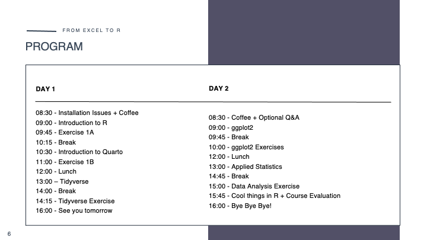

## Welcome to the main page of From Excel to R

This 2 day course serves as an introduction to the statistical programming language R for researchers at the Faculty of Health and Medical Sciences, University of Copenhagen. The course is build on code-along presentations and exercises in Quarto documents.

\
The course goes through the following topics:

1.  The basics of R, Rstudio and Quarto
2.  Data wrangling with tidyverse
3.  Plotting with ggplot2
4.  Basic applied data science and statistics

The material in this repository is for teaching purposes only and not to be distributed commercially.

\
We will use Quarto for the tutorials of this course. Please see more about Quarto following the links below.\
[An introduction to Quarto in RStudio](https://www.youtube.com/watch?v=PzIO1FxhqIw)\
[Quarto website](https://quarto.org)\
["Get started with Quarto" tutorial for RStudio](https://quarto.org/docs/get-started/hello/rstudio.html)\
["Get started with Quarto" video for RStudio\
](https://www.youtube.com/watch?v=_f3latmOhew)[Comprehensive guides to Quarto basics](https://quarto.org/docs/guide/)

\
Finally... Dear course participants, it would greatly help us if you could complete our [feedback](https://forms.office.com/e/gwQxMdwALA) form. 

## Program

